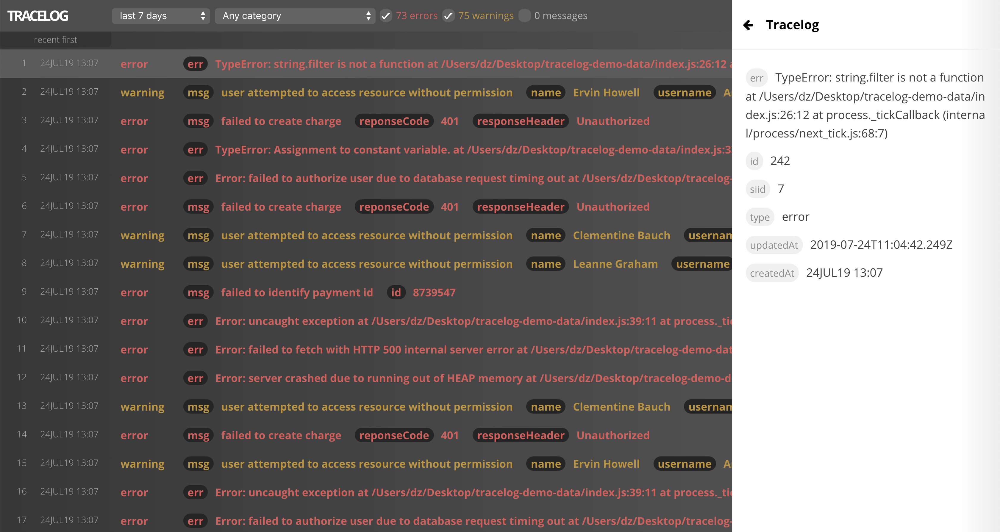

# Tracelog
Tracelog is a log drain web service used by developers to capture and reduce bugs in production.

When an error do occur in a system or application it is sent over to Tracelog where the bug is saved and becomes visible in the dashboard with relevant details useful for resolving and debugging the error. In other words when something does go wrong, Tracelog tracks the event so it can be prevented from happening again.

* Convenient to integrate with thru REST API including full documentation below
* Monitor, filter, track bugs in the interactive web client
* Safe and secure- your data is protected behind authentication wall
* Get it as a service (contact admin) or spin up your own copy!



## REST API Documentation
Routes: 
* Requires authorisation see POST /auth  
* Accpets and returns Content-Type: application/json

### **POST /auth**
Verifies the secret and returns a Bearer token allowing subsequent requests to access api resources when Authorization header is set to: Bearer token-xxxxxx.  
  
Requires json:  
```
{
  //service instance sercret encoded with base64
  secret: 'pfmHE+9XPWHOQFJN<3UYT2FIjw'
}
```
Returns json response:  
  * 200 OK { token: xxxxxxxxxx }  
  * 403 FORBIDDEN if the secret did not checkout

### **POST /api/log**
Creates a log within the service instance.  
  
Requires json:
```
{
  //error, message, warning
  type: "error",  

  //data useful for debugging or tracking purposes
  data: { paymentId: 999 },

  //category makes the log easily identifiable
  cat: "payment"
}
```

### **GET /api/log**
Get latest 1500 logs from the service instance ordered by latest first.  
Returns response: 200 OK with json array of logs  
```
{ 
  id: 123,
  siid: 1,
  cat: "payment",
  data: { message: "payment charged notice" },
  type: "message",
  createdAt: "2020-07-10T10:31:53.758Z",
  updatedAt: "2020-07-10T10:31:53.758Z"
}
```

## Spin up for local development
* Ensure docker with docker-compose are installed and running
* In project root run `docker-compose up`
* On initial startup the database will be migrated and seeded
* Access web client on: http://localhost:3000 (login with injected user)
* Server is running on: http://localhost:8080

## Stack
* Database: Postgres
* Server: Node.js, Expressjs, Sequelize/ORM
* Documentation: README Markdown
* Regression testing: Jest
* Argeitchture: MVC Monolithic
* Web Client: React (create-react-app), Redux, Reselect
* Containerized with Docker
